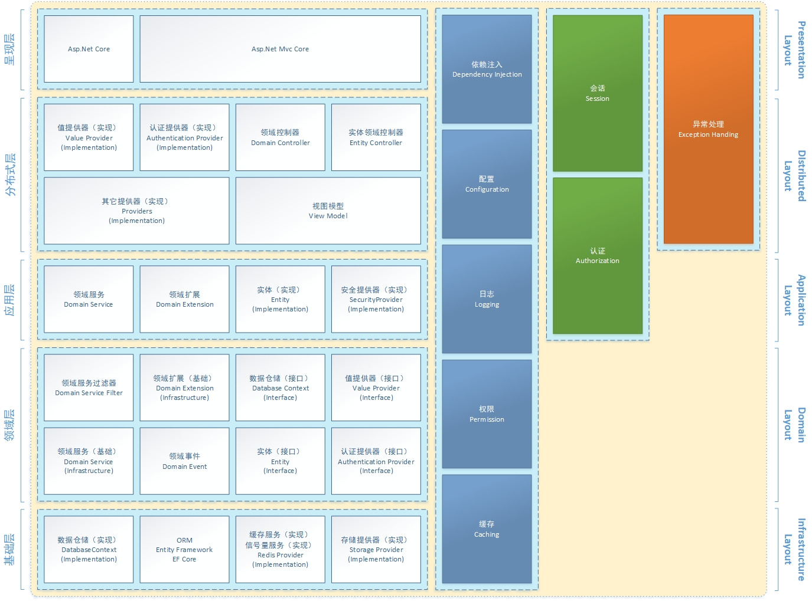

# ComBoost 3.0

## ComBoost是什么？
ComBoost是一个通用性的应用程序框架，专门设计用于开发新型应用程序。框架提供了高扩展、低耦合的组件，为开发者提供高效可靠的开发体验。    
ComBoost 3.0基于.Net Standard目标框架实现。3.0版本开始将从实体框架转变为服务框架，不再仅限于实体类目标。

## 分层架构
ComBoost基于DDD领域驱动设计提供一个分层架构模型。

## 示例
* [论坛组件示例](https://github.com/Wodsoft/Wodsoft.Forum)

## Nuget包
ComBoost框架分发了以下Nuget包。

|包名|状态|说明|
|:---|:---|:---|
|Wodsoft.ComBoost||包含领域服务的一些基础接口实现，例如DomainContext，DomainService，DomainProvider等。用于领域服务项目|
|Wodsoft.ComBoost.AspNetCore||包含基于AspNetCore的Http领域上下文实现|
|Wodsoft.ComBoost.AspNetCore.Security||包含Asp.Net Core的身份认证模块功能，方便开发者进行身份验证。用于非Mvc网站项目，一般不直接引用|
|Wodsoft.ComBoost.Core||包含框架核心接口定义与接口的扩展方法。一般不直接引用|
|Wodsoft.ComBoost.Data||包含实体领域服务。用于网站项目|
|Wodsoft.ComBoost.Data.Core||包含实体领域的接口定义、基础实现与通用扩展方法等。用于实体层项目|
|Wodsoft.ComBoost.EntityFramework||包含Entity Framework 6.x的实现。用于网站项目|
|Wodsoft.ComBoost.EntityFrameworkCore||包含Entity Framework Core 2.x 的实现。用于网站项目|
|Wodsoft.ComBoost.Mock||包含领域服务单元测试的模拟模块，可以方便的编写领域服务的单元测试。用于单元测试项目|
|Wodsoft.ComBoost.Mvc||包含领域控制器，领域视图组件，Mvc领域上下文等基础类型，方便开发者调用领域服务。用于Mvc网站项目|
|Wodsoft.ComBoost.Mvc.Data||包含实体领域控制器，方便开发者编写增删查改。用于Mvc网站项目|
|Wodsoft.ComBoost.Redis||包含使用Redis的缓存、锁的实现。用于领域服务项目|
|Wodsoft.ComBoost.Security||包含框架权限核心模块。一般不直接引用|
|Wodsoft.ComBoost.Storage||包含使用本地物理文件实现的储存提供器。一般用于领域服务项目|

## 许可证
[MIT](LICENSE)